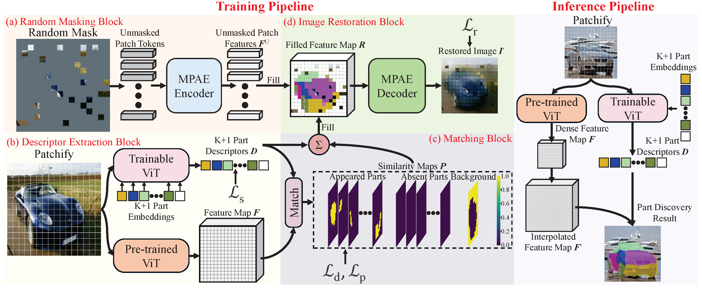
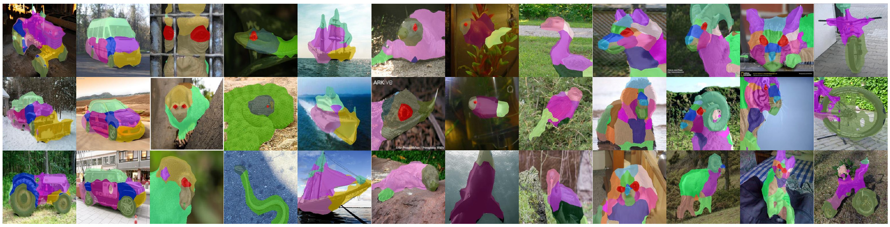

# Masked Part AutoEncoder (MPAE)
PyTorch code and pretrained models for **MPAE** (Mask Part AutoEncoder).



MPAE is a novel paradigm for unsupervised part 
discovery that parses multiple categories into 
meaningful parts. Each part contains consistent 
semantics across various objects and can be further 
used for fine-grained classification and 3D reconstruction.




## Installation
#### Note: this released version was tested on Python3.9, Pytorch 1.8 and Windows 10.

Install python dependencies:
```
pip3 install -r requirements.txt
```

## Run Evaluation and Training on CelebA, CUB, PartImageNet datasets
1. Download and process CelebA, CUB, PartImageNet dataset
    * Download CelebA dataset and annotation from [Here](https://mmlab.ie.cuhk.edu.hk/projects/CelebA.html).
    * Download CUB dataset and annotation from [Here](https://www.vision.caltech.edu/datasets/cub_200_2011/).
    * Download PartImageNet dataset and annotation from [Here](https://github.com/TACJu/PartImageNet).
    * Please refer to [PDiscoFormer](https://github.com/ananthu-aniraj/pdiscoformer/tree/main) for the train/test split of PartImageNet_OOD and PartImageNet_Seg.
    * Unzip these three datasets and annotations and move files into ```./Data``` directory. Your directory should look like this:
        ```
        MPAE
        └───Data
           │
           └───CelebA 
           │  │
           │  └───cele_train_lm.txt
           │  └───MAFL_test_lm.txt
           │  └───img_celeba
           │      └───000001.jpg
           │      │
           │      └───...
           └───CUB
           │  │  
           │  └───train_list.txt
           │  └───test_list.txt
           │  └───bounding_boxes.txt
           │  └───...     
           │  └───images
           │      └───001.Black_footed_Albatross
           │      │
           │      └───..
           │
           └───PartImageNet_OOD
           │
           └───PartImageNet_Seg

        ```

2. Download pretrained model from [Google Drive](https://drive.google.com/drive/folders/14xZoWcW2-CAM4gZPHBHak2wnkiUBQlvT?usp=sharing).
    <table>
      <thead>
        <tr style="text-align: right;">
          <td>Dataset</td>
          <td>CelebA_K16</td>
          <td>CUB_K16</td>
          <td>PartImageNet_Seg</td>
          <td>PartImageNet_OOD</td>
        </tr>
      </thead>
      <tbody>
        <tr>
          <td>NMI (%)</td>
          <td>70.21</td>
          <td>79.00</td>
          <td>55.10</td>
          <td>53.65</td>
        </tr>
        <tr>
          <td>ARI (%)</td>
          <td>60.33</td>
          <td>66.56</td>
          <td>73.52</td>
          <td>74.22</td>
        </tr>
      </tbody>
    </table>
   
    Put the model in ```./model``` directory.

3. Test
    ```
    CelebA: python Evaluation.py --Dataset="CelebA" --model='./model/CelebA_K16.pth' --Num_Part=17
    CUB: python Evaluation.py --Dataset="CUB" --model='./model/CUB_K16.pth' --Num_Part=17
    PartImageNet_OOD: python Evaluation.py --Dataset="PartImage" --model='./model/PartImage_O_K50.pth' --Num_Part=51
    PartImageNet_Seg: python Evaluation.py --Dataset="PartImage_Seg" --model='./model/PartImage_S_K50.pth' --Num_Part=51
    ```

4. Train
    ```
    CelebA: python train.py --Dataset="CelebA" --Num_Part=17 --Epoch=20 --LR_step 15 18
    CUB: python train.py --Dataset="CUB" --Num_Part=17 --Epoch=100 --LR_step 80 90
    PartImageNet_OOD: python train.py --Dataset="PartImage" --Num_Part=51 --Epoch=70 --LR_step 50 60
    PartImageNet_Seg: python train.py --Dataset="PartImage_Seg" --Num_Part=51 --Epoch=70 --LR_step 50 60
    ```
   
## Citation
If you find this work or code is helpful in your research, please cite:
```
@inproceedings{MPAE,
  title={Unsupervised Part Discovery via Descriptor-Based Masked Image Restoration with Optimized Constraints},
  author={Jiahao Xia and Yike Wu and Wenjian Huang and Jianguo Zhang and Jian Zhang},
  booktitle={ICCV},
  year={2025}
}
```

## License
MPAE is released under the GPL-2.0 license. Please see the [LICENSE](LICENSE) file for more information.

## Acknowledgments
   * This repository borrows or partially modifies the models from [PDiscoFormer](https://github.com/ananthu-aniraj/pdiscoformer/tree/main)

